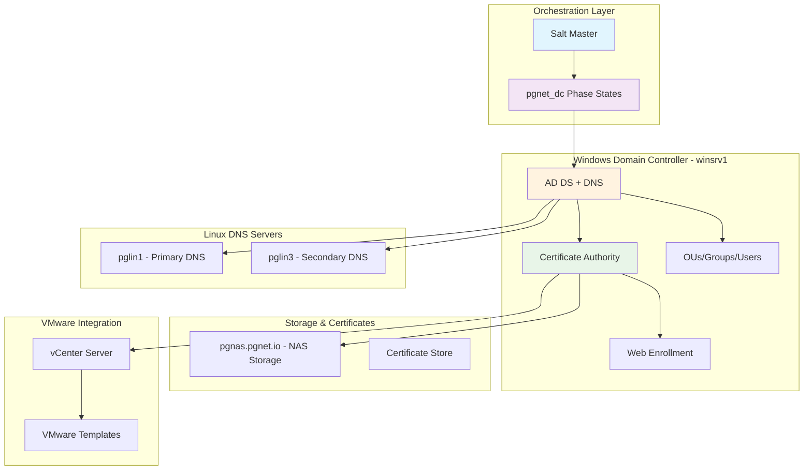

# VCF 9.0.2 Deployment Guide - Post-Deployment: Windows AD Server Deployment

**Phase:** Post-Deployment (Day 2) - **Pre-requisite for Section 4.1**

This document outlines the **Salt Stack infrastructure** used to automatically provision and configure the Windows Active Directory domain controller environment. This infrastructure acts as the core identity hub for VCF (Active Directory, DNS, NTP, CA).

## 1. Overview

This system provides automated provisioning of a Windows Server 2022 domain controller (`winsrv1`), integrated with existing Linux DNS servers (`pglin1`), and configured to support VMware Cloud Foundation requirements (Certificates, Users, Groups).

### Key Components

- **Active Directory Domain Controller** (`pgnet.local`)
- **Certificate Authority** with ADCS and Web Enrollment
- **DNS Configuration** with conditional forwarding to `pgnet.io`
- **Organizational Units, Groups, and Users** setup
- **Certificate Management** for wildcard certificates
- **VMware Integration** with specialized certificate templates

### Target Environment

- **Primary Domain:** `pgnet.local`
- **External Domains:** `pgnet.io`, `pggb.net`
- **Target Servers:** `winsrv1` (Windows Server 2022), Linux DNS servers (`pglin1`, `pglin3`)
- **Process:** PG Salt phase-based states (`pgnet_dc.*`) applied directly to `winsrv1`

## 2. Architecture



## 3. PG Salt Phase-Based Process

The current PG Salt process runs **direct, ordered state applies** on `winsrv1`, with manual vCenter snapshots between phases. This replaces the older orchestration approach.

### Prerequisites (before Phase 1)

- Windows Server 2022 VM created
- Hostname set to `winsrv1`
- Static IP configured; primary DNS set to `127.0.0.1`
- NTP configured
- Salt minion installed; key accepted on the master
- Snapshot **S0-fresh** taken before any AD changes

### Phase Commands (in order)

```bash
# Phase 1: DC promotion (provide complex password)
salt 'winsrv1' state.apply pgnet_dc.dc_promote pillar='{"pgnet":{"dsrm_password":"YOUR_COMPLEX_PASSWORD","safe_mode_password":"YOUR_COMPLEX_PASSWORD"}}'

# Reboot, then Phase 2: DNS config
salt 'winsrv1' state.apply pgnet_dc.dns_config

# Phase 3-4: OUs, groups, users
salt 'winsrv1' state.apply pgnet_dc.ous_groups_users
salt 'winsrv1' state.apply pgnet_dc.verify_ous_users

# Phase 5: CA setup
salt 'winsrv1' state.apply pgnet_dc.ca_setup

# Phase 6: Full verification
salt 'winsrv1' state.apply pgnet_dc.verify
```

### Snapshot Points

| Snapshot       | When                                           |
| -------------- | ---------------------------------------------- |
| **S0-fresh**   | Before Phase 1                                 |
| **S2-dc-only** | After Phase 1 and reboot                       |
| **S3-pre-ca**  | After Phase 3-4 (OUs, groups, users)           |
| **S5-complete**| After Phase 5 (CA, templates, svc-vcf-ca)      |

## 4. Phase Details

### Phase 1: Domain Controller Promotion

**Duration**: ~10-15 minutes **Reboots**: 1 reboot (required after DC promotion)

#### Steps:

1. **AD DS Installation**: Install Active Directory Domain Services role
2. **DNS Installation**: Install DNS Server role
3. **Forest Creation**: Promote to Domain Controller with new forest
4. **Reboot**: Restart server and validate AD services

#### Command:

```bash
salt 'winsrv1' state.apply pgnet_dc.dc_promote pillar='{"pgnet":{"dsrm_password":"YOUR_COMPLEX_PASSWORD","safe_mode_password":"YOUR_COMPLEX_PASSWORD"}}'
```

#### Snapshot:

- Take **S2-dc-only** after reboot completes

### Phase 2: DNS Configuration

**Duration**: ~5 minutes **Reboots**: None

#### Steps:

1. **DNS Records**: Create A record for DC and CNAME for CA
2. **Conditional Forwarders**: Set up forwarding to Linux DNS servers
  - `pgnet.io` → pglin1 (10.200.1.240), pglin2 (10.200.10.75)
  - `pggb.net` → pglin1 (10.200.1.240), pglin2 (10.200.10.75)

#### Command:

```bash
salt 'winsrv1' state.apply pgnet_dc.dns_config
```

### Phase 3-4: Active Directory Structure

**Duration**: ~10 minutes **Reboots**: None

#### Steps:

1. **OU Creation**: Create organizational unit hierarchy
2. **Group Creation**: Create security and distribution groups
3. **User Creation**: Create user accounts with proper group memberships
4. **Service Accounts**: Create service accounts for VCF integration
5. **Verification**: Verify all AD objects created successfully

#### Commands:

```bash
salt 'winsrv1' state.apply pgnet_dc.ous_groups_users
salt 'winsrv1' state.apply pgnet_dc.verify_ous_users
```

#### Organizational Structure Created:

```
DC=pgnet,DC=local
├── OU=it
│   ├── OU=ServiceAccounts (svc-vcf-ca, svc-ldap, svc-certexport)
│   ├── OU=Groups (VCF-Cloud-Admins, VCF-NSX-Admins, etc.)
│   └── OU=Users (admin, peteha, devopsadmin, etc.)
├── OU=corp
│   ├── OU=Users
│   ├── OU=Groups
│   └── OU=Computers
├── OU=sales
│   ├── OU=Users
│   ├── OU=Groups
│   └── OU=Computers
└── OU=engineering
    ├── OU=Users
    ├── OU=Groups
    └── OU=Computers
```

### Phase 5: Certificate Authority Setup

**Duration**: ~10-15 minutes **Reboots**: None

#### Steps:

1. **ADCS Installation**: Install Certificate Authority role
2. **Web Enrollment**: Install and configure Web Enrollment
3. **IIS Configuration**: Enable Basic Authentication for VCF compatibility
4. **VMware Template**: Create VMware-specific certificate template
5. **Service Account Permissions**: Configure svc-vcf-ca permissions
6. **Certificate Export**: Generate and export wildcard certificates

#### Certificate Templates Created:

- **WebServer**: Standard web server certificates
- **VMware**: VCF-specific template with enhanced key usage
  - Authentication: Client Authentication, Server Authentication
  - Key Usage: Digital Signature, Key Encipherment, Key Agreement
  - Enhanced Key Usage: Server Authentication, Client Authentication

#### Command:

```bash
salt 'winsrv1' state.apply pgnet_dc.ca_setup
```

#### Snapshot:

- Take **S5-complete** after CA setup

### Phase 6: Verification

**Duration**: ~5 minutes **Reboots**: None

#### Command:

```bash
salt 'winsrv1' state.apply pgnet_dc.verify
```

## 5. Supporting Components

### DNS Integration (`dns/init.sls`)

- **Primary DNS Servers**: pglin1 (10.200.1.240), pglin3 (10.200.10.60)
- **Zone Transfer**: Automated using Salt Mine for IP discovery
- **Conditional Forwarding**: Seamless multi-domain resolution

### Certificate Management (`certbot/` + `pgnet_dc/ca_*`)

- **Wildcard Certificates**: `*.pgnet.local`, `*.pgnet.io`, `*.pggb.net`
- **Automated Export**: PFX, PEM, and Key formats
- **Secure Storage**: NAS-based certificate repository
- **Password Generation**: Runtime-generated secure passwords

### Storage Integration (`nfs.sls`, `mapsmb.sls`)

- **NFS Mounts**: Automated NFS client configuration
- **SMB Mapping**: Windows-based SMB share access
- **pgnas.pgnet.io**: Central storage for certificates and data

## 6. Data Structure

### Pillar Configuration (`pillar/pgnet.sls`)

```yaml
pgnet:
  domain: pgnet.local
  hostname: winsrv1
  
  network:
    dns_servers:
      - 10.200.1.240
      - 10.200.10.75
  
  credentials:
    dsrm_password: VMware123!VMware123!
    safe_mode_password: VMware123!VMware123!
    default_user_password: VMware123!VMware123!
    service_account_password: VMware123!VMware123!
    certexport_account: svc-certexport
    certexport_password: VMware123!VMware123!
    ldap_bind_user: svc-ldap
    ca_service_account: svc-vcf-ca
  
  certificates:
    domains:
      - pgnet.local
      - pgnet.io
      - pggb.net
```

### User and Group Data (`salt/data/pgnet/`)

- **users.yaml**: Defines user accounts, OU placement, and group memberships.
- **groups.yaml**: Defines VCF role groups and business unit groups.
- **ous.yaml**: Defines hierarchical organizational unit structure.

## 7. Monitoring and Verification

### Built-in Verification Scripts

1. **verify-domain.ps1**: Comprehensive domain validation (DC, DNS, OU, Groups, Users).
2. **verify-ous-users.ps1**: Detailed AD object verification.
3. **test-ldaps.ps1**: LDAP over SSL testing.
4. **test-https-binding.ps1**: Certificate binding verification.

### Verification Results Format

```text
=== pgnet.local Domain Setup Verification ===

--- 1. Domain and Global Catalog ---
[PASS] Domain 'pgnet.local' exists
[PASS] Global Catalog present (expected winsrv1, found winsrv1.pgnet.local)

--- 2. DNS Resolution ---
[PASS] DNS resolves winsrv1.pgnet.local
[PASS] DNS resolves pgnet.local

--- 3. OU Structure ---
[PASS] OUs created: it (ServiceAccounts, Groups, Users), corp, sales, engineering (16/16)

Total: 15 PASS, 0 FAIL
```

## 8. External vSphere Cluster SSO Configuration

**Phase:** Post-Process (Manual Configuration in vCenter).

Once the PG Salt phase sequence is complete, use these parameters to add the Active Directory as an Identity Source in vCenter Server (**Administration > Single Sign-On > Configuration > Identity Sources**).

| Field                                  | Value                                                    | Notes                                                        |
| -------------------------------------- | -------------------------------------------------------- | ------------------------------------------------------------ |
| **Identity Source Type**               | Active Directory over LDAP                               |                                                              |
| **Identity source name**               | `pgnet.local`                                            |                                                              |
| **Base distinguished name for users**  | `DC=pgnet,DC=local`                                      | Sets scope to entire domain to include users in `it`, `corp`, `sales`, etc. |
| **Base distinguished name for groups** | `DC=pgnet,DC=local`                                      | Sets scope to entire domain to include groups in all OUs.    |
| **Domain name**                        | `pgnet.local`                                            |                                                              |
| **Domain alias**                       | `pgnet`                                                  |                                                              |
| **Username**                           | `CN=svc-ldap,OU=ServiceAccounts,OU=it,DC=pgnet,DC=local` | Bind account created by Salt.                                |
| **Password**                           | `VMware123!VMware123!`                                   | Default service account password.                            |
| **Connect to**                         | Specific domain controllers                              |                                                              |
| **Primary server URL**                 | `ldaps://winsrv1.pgnet.local:636`                        | Requires CA cert trust.                                      |
| **Certificates**                       | *Upload Root CA Certificate*                             | Export from NAS/SMB share (`rootca.cer`).                    |

## Appendix A: PowerShell Script Outputs (Reference)

### A.1: Domain Controller Promotion (`promote-dc.ps1`)

```powershell
PS C:\> Install-ADDSForest -DomainName 'pgnet.local' -InstallDns -SafeModeAdministratorPassword $sec -Force -NoRebootOnCompletion
Message        : Operation completed successfully
Context        : DCPromo.General.3
RebootRequired : True
Status         : Success
```

### A.2: Wildcard Certificate Export (`export-wildcard-final.ps1`)

```text
[2024-02-09T10:15:35] Certificate Issued Successfully!
[2024-02-09T10:15:36] Exporting PFX to C:\pgnet\certs\wildcard\wildcard.pfx
[2024-02-09T10:15:38] Syncing files to NAS Secure Store...
[2024-02-09T10:15:39] [OK] Synced wildcard.pem
[2024-02-09T10:15:39] [OK] Synced wildcard.key
[2024-02-09T10:15:40] [OK] Synced rootca.cer
```

## Appendix B: Configuration Files (Reference)

### B.1: Phase Command Summary

```text
Phase 1: DC Promotion
  salt 'winsrv1' state.apply pgnet_dc.dc_promote pillar='{"pgnet":{"dsrm_password":"YOUR_COMPLEX_PASSWORD","safe_mode_password":"YOUR_COMPLEX_PASSWORD"}}'
  Reboot, then snapshot S2-dc-only

Phase 2: DNS Configuration
  salt 'winsrv1' state.apply pgnet_dc.dns_config

Phase 3-4: AD Structure (OUs, Groups, Users)
  salt 'winsrv1' state.apply pgnet_dc.ous_groups_users
  salt 'winsrv1' state.apply pgnet_dc.verify_ous_users
  Snapshot S3-pre-ca

Phase 5: Certificate Authority
  salt 'winsrv1' state.apply pgnet_dc.ca_setup
  Snapshot S5-complete

Phase 6: Verification
  salt 'winsrv1' state.apply pgnet_dc.verify
```

## Appendix C: AD Groups Reference

These groups are created automatically in Phase 3-4.

| Group Name                 | Path (OU)   | Full LDAP Distinguished Name (DN)                            |
| -------------------------- | ----------- | ------------------------------------------------------------ |
| **VCF-Cloud-Admins**       | `it/Groups` | `CN=VCF-Cloud-Admins,OU=Groups,OU=it,DC=pgnet,DC=local`      |
| **VCF-NSX-Admins**         | `it/Groups` | `CN=VCF-NSX-Admins,OU=Groups,OU=it,DC=pgnet,DC=local`        |
| **VCF-vSphere-Admins**     | `it/Groups` | `CN=VCF-vSphere-Admins,OU=Groups,OU=it,DC=pgnet,DC=local`    |
| **VCF-Operations**         | `it/Groups` | `CN=VCF-Operations,OU=Groups,OU=it,DC=pgnet,DC=local`        |
| **VCF-Auditors**           | `it/Groups` | `CN=VCF-Auditors,OU=Groups,OU=it,DC=pgnet,DC=local`          |
| **VCF-Certificate-Admins** | `it/Groups` | `CN=VCF-Certificate-Admins,OU=Groups,OU=it,DC=pgnet,DC=local` |

## Appendix D: AD Organizational Units Reference

| Path                   | Full LDAP Distinguished Name (DN)            |
| ---------------------- | -------------------------------------------- |
| **it**                 | `OU=it,DC=pgnet,DC=local`                    |
| **it/ServiceAccounts** | `OU=ServiceAccounts,OU=it,DC=pgnet,DC=local` |
| **it/Groups**          | `OU=Groups,OU=it,DC=pgnet,DC=local`          |
| **it/Users**           | `OU=Users,OU=it,DC=pgnet,DC=local`           |
| **corp**               | `OU=corp,DC=pgnet,DC=local`                  |
| **sales**              | `OU=sales,DC=pgnet,DC=local`                 |
| **engineering**        | `OU=engineering,DC=pgnet,DC=local`           |

## Appendix E: AD Users & Service Accounts Reference

| Name           | OU                   | Full LDAP Distinguished Name (DN)                          | Description              |
| -------------- | -------------------- | ---------------------------------------------------------- | ------------------------ |
| **admin**      | `it/Users`           | `CN=admin,OU=Users,OU=it,DC=pgnet,DC=local`                | Domain Administrator     |
| **peteha**     | `it/Users`           | `CN=peteha,OU=Users,OU=it,DC=pgnet,DC=local`               | Primary Admin            |
| **svc-vcf-ca** | `it/ServiceAccounts` | `CN=svc-vcf-ca,OU=ServiceAccounts,OU=it,DC=pgnet,DC=local` | CA Mgmt Service Account  |
| **svc-sddc**   | `it/ServiceAccounts` | `CN=svc-sddc,OU=ServiceAccounts,OU=it,DC=pgnet,DC=local`   | SDDC Integration Account |
| **svc-ldap**   | `it/ServiceAccounts` | `CN=svc-ldap,OU=ServiceAccounts,OU=it,DC=pgnet,DC=local`   | LDAP Bind Account        |